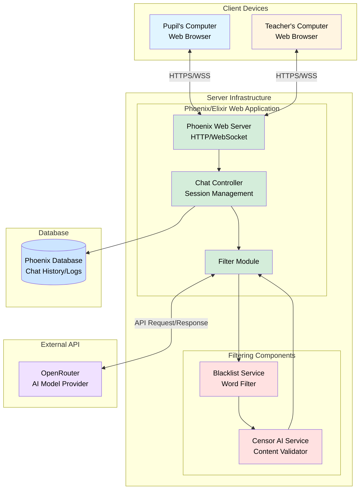

# Architecture Documentation

## Overview

This document describes the technical architecture of `Coldplay`, a web application designed to provide safe, AI-powered educational assistance to school children with teacher oversight.

## System Architecture

## Components

### Client Layer

#### Pupil's Computer
- **Technology**: Web Browser on school computers
- **Interface**: Pupil-specific UI for asking educational questions
- **Communication**: HTTPS/WebSocket Secure (WSS) connection to server
- **Role**: Submits questions and receives filtered AI responses

#### Teacher's Computer
- **Technology**: Web Browser on school computers
- **Interface**: Teacher-specific monitoring dashboard
- **Communication**: HTTPS/WebSocket Secure (WSS) connection to server
- **Role**: Real-time monitoring of pupil-AI interactions, session oversight

### Server Infrastructure

#### Phoenix/Elixir Web Application

The core application is built using Phoenix Framework running on the Elixir/BEAM virtual machine, providing:

- **Concurrency**: Handles multiple simultaneous chat sessions efficiently
- **Real-time Communication**: WebSocket support for live interactions
- **Fault Tolerance**: Supervisor trees ensure system resilience

**Components:**

##### Phoenix Web Server
- Serves static assets (HTML, CSS, JavaScript)
- Handles HTTP requests and WebSocket connections
- Manages client authentication and session establishment
- Routes requests to appropriate controllers

##### Chat Controller
- Manages individual chat sessions
- Maintains session state (pupil, teacher, conversation history)
- Coordinates message flow between clients, AI, and filters
- Handles role-based access (pupil vs teacher permissions)

##### Filter Module
- Orchestrates the content filtering pipeline
- Sends pupil questions to OpenRouter AI
- Routes AI responses through filtering services
- Returns filtered responses to pupils or blocks inappropriate content

#### Filtering Components

##### Blacklist Service
- **Purpose**: First-line defense against inappropriate content
- **Method**: Keyword-based filtering using a predefined list of forbidden words
- **Action**: Blocks responses containing blacklisted terms immediately
- **Performance**: Fast, synchronous operation

##### Censor AI Service
- **Purpose**: Contextual content safety evaluation
- **Method**: AI-powered analysis of response appropriateness
- **Checks**: Sexual content, explicit material, age-inappropriate topics (configurable)
- **Action**: Blocks responses deemed unsuitable for school children

### External Services

#### OpenRouter
- **Purpose**: AI model provider for educational question answering
- **Protocol**: REST API over HTTPS
- **Models**: Configurable (To be decided)
- **Rate Limiting**: Implemented to prevent abuse and control costs

### Data Layer

#### Phoenix Database
- **Technology**: PostgreSQL
- **Purpose**: Persistence layer for application data
- **Stored Data**:
  - Chat session metadata
  - Conversation history
  - User information (pupils, teachers)
  - Audit logs for compliance
  - Filtering decisions and blocked content reports

## Data Flow

### Question-Answer Flow

1. **Question Submission**: Pupil types a question (e.g., "Why did Napoleon fail to invade Russia?") and submits it through the web interface

2. **Server Reception**: Phoenix Web Server receives the question via WebSocket connection

3. **Session Management**: Chat Controller identifies the session and verifies permissions

4. **AI Request**: Filter Module forwards the question to OpenRouter API

5. **AI Response**: OpenRouter returns an AI-generated answer

6. **Content Filtering**:
   - **Stage 1**: Blacklist Service scans for forbidden words
   - **Stage 2**: If passed, Censor AI evaluates contextual appropriateness
   - **Decision**: Content is either approved or blocked

7. **Response Delivery**: If approved, the filtered answer is sent to the pupil's browser

8. **Teacher Notification**: Teacher receives real-time updates about the interaction

9. **Persistence**: Chat history and filtering decisions are logged to the database

### Monitoring Flow

Teachers maintain persistent WebSocket connections to receive:
- New questions from pupils
- AI responses (both approved and blocked)
- Session status updates
- Alert notifications for blocked content

## Security Considerations

### Content Safety
- **Multi-layer filtering**: Combines rule-based (blacklist) and AI-based (censor) approaches
- **Zero-tolerance policy**: Any flagged content is blocked entirely
- **Audit trail**: All filtering decisions are logged for review

### Network Security
- **HTTPS/WSS**: All client-server communication is encrypted
- **Authentication**: Role-based access control for pupils and teachers
- **API Keys**: Secure storage of OpenRouter credentials (environment variables)

### Privacy
- **Data minimization**: Only necessary information is collected
- **Access control**: Teachers can only monitor assigned sessions
- **Retention policy**: Chat logs follow institutional data retention requirements

## Scalability

### Horizontal Scaling
- Phoenix/Elixir applications can be clustered across multiple nodes
- WebSocket connections are distributed using consistent hashing
- Database can be scaled with read replicas

### Performance Optimization
- **Response caching**: Frequently asked questions can be cached
- **Filter optimization**: Blacklist checking is O(1) with hash-based lookup
- **Async processing**: AI requests and filtering run asynchronously

## Deployment

### Production Environment
- **Web Server**: Multiple Phoenix instances behind a load balancer
- **Database**: PostgreSQL with automated backups
- **Monitoring**: Application performance monitoring (APM) and logging
- **Infrastructure**: Cloud-based (AWS, GCP, Azure) or on-premises

### Configuration
Environment variables control:
- `OPENROUTER_API_KEY`: API credentials
- `DATABASE_URL`: Database connection string
- `SECRET_KEY_BASE`: Phoenix session encryption
- `CENSOR_AI_ENDPOINT`: Content filtering service URL
- `BLACKLIST_PATH`: Location of forbidden words list

## Future Enhancements

- **Multi-language support**: Filtering in languages beyond English
- **Advanced analytics**: Teacher dashboard with usage statistics
- **Adaptive filtering**: Machine learning to improve censor accuracy
- **Voice interface**: Speech-to-text for accessibility
- **Mobile applications**: Native iOS and Android apps
